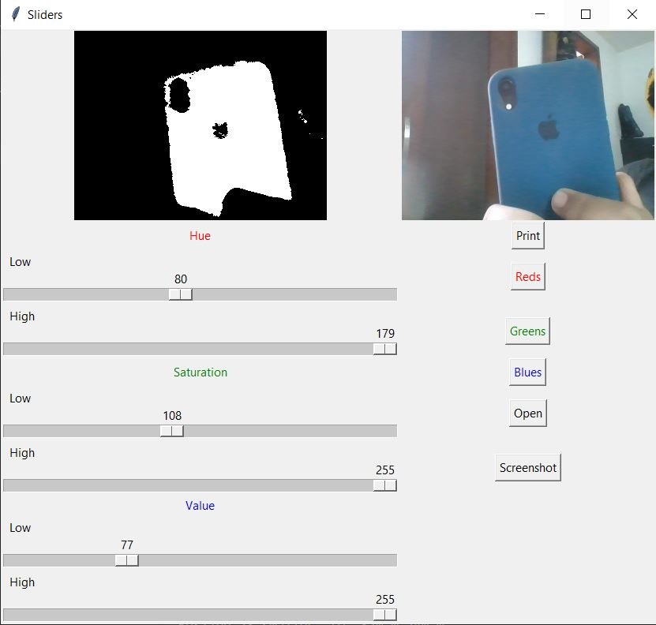
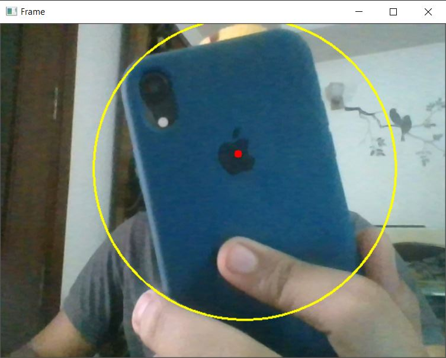

# Object tracking based on color
object tracking based on color using OpenCV

### 1.setting up the HSV value using colorCalibrationforHSV.py(this will be according to your color)

the values that make the object appear totally white will be the correct values

### Output

the output will display a frame where object is being tracked and its position will be displayed in the console

